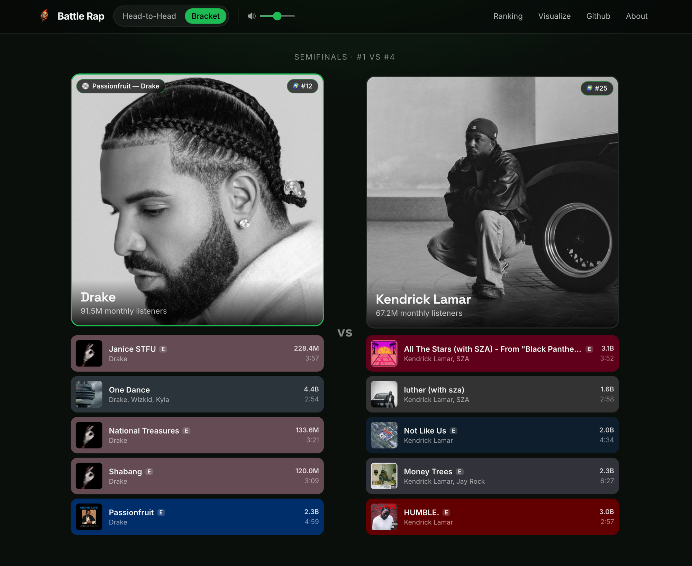

# [Battle Rap](https://battle-rap.vercel.app)

A project built to answer the quintessential question: who is the greatest rapper?



## Tech stack

**Frontend** — [Next.js 16](https://nextjs.org/) (App Router, Turbopack) + [React 19](https://react.dev/) + TypeScript + [Tailwind CSS v4](https://tailwindcss.com/), hosted on [Vercel](https://vercel.com/). Server components read straight from MotherDuck (`frontend/lib/data.ts`); no separate API backend.

**Data warehouse** — [MotherDuck](https://motherduck.com/) (managed cloud DuckDB): `raw` (Spotify ingest + vote ledger), `staging`, and `mart` schemas in a single database. Queried directly from Next.js via [`@duckdb/node-api`](https://www.npmjs.com/package/@duckdb/node-api).

**Transform** — [dbt](https://www.getdbt.com/) (`dbt-duckdb`) builds staging → mart models, with tests and snapshots. Includes `mart.elo` — a blended Elo rating (casual head-to-head + bracket matches weighted higher) computed with a recursive CTE, since Elo is inherently sequential and can't be a flat aggregate.

**Ingestion** — Python 3.12 + [`spotapi`](https://github.com/Aran404/SpotAPI) (Spotify's internal web endpoints — no API key, no Premium needed), seeded by hip-hop genres/playlists, one fetch per artist parallelized with a thread pool. Deps locked with [uv](https://docs.astral.sh/uv/). Scraping an unofficial endpoint means routine partial failures, so the `raw` tables are append-only snapshots: `stg_rappers` keeps each artist's last good observation and `mart.rappers_filtered` retires them only after 14 days unseen, instead of a single rate-limited run emptying the battle pool.

**Orchestration** — [GitHub Actions](.github/workflows/refresh-rappers.yml) runs the daily ingest + `dbt build` on a cron.

> Previously: Spotify Web API → Supabase → GCS → BigQuery → Power BI, orchestrated by Airflow. Spotify gated the Web API behind an app-owner Premium subscription, so the stack was rebuilt on free foundations. The full story + the old architecture are archived in [`docs/HISTORY.md`](docs/HISTORY.md).

## How it works

1. **Ingest** — artist & track data lands in MotherDuck's `raw` schema.
2. **Transform** — dbt builds `staging` → `mart` models (rappers, top tracks, standings, Elo).
3. **Serve** — the web app has three modes: head-to-head voting (`/`), a seeded bracket/tournament mode (`/bracket`), and a live ranking page (`/ranking`) with sortable Elo/win-rate/bracket-record columns. User picks are written back to MotherDuck (`raw.results` / `raw.bracket_results`).
4. **Visualize** — `/visualize` embeds a legacy Power BI report (Evidence.dev planned as its replacement, see `docs/HISTORY.md`).

## Layout

| Path | What |
|------|------|
| `frontend/` | Next.js app — pages, API routes, `lib/data.ts` (queries), `lib/motherduck.ts` (DB client) |
| `ingestion/` | spotapi client, artist lister, MotherDuck loader |
| `dbt/` | staging + mart models, tests, snapshots (dbt-duckdb → MotherDuck) |
| `.github/workflows/` | scheduled `refresh-rappers` pipeline |
| `docs/` | architecture history, design notes, parked proposals |

## Run locally

```bash
uv sync

# ingest to a local DuckDB file (no MotherDuck needed)
DUCKDB_LOCAL_PATH=~/br.duckdb uv run python -m ingestion.load_rappers

# build + test models against that file
cd dbt && DBT_DUCKDB_PATH=~/br.duckdb uv run dbt build --profiles-dir .
```

Against MotherDuck: set `motherduck_token` in the environment and drop the `*_PATH` overrides (both loader and dbt default to `md:battlerap`).

For the frontend:

```bash
cd frontend
npm install
cp .env.example .env.local   # set motherduck_token, or DUCKDB_PATH for a local file
npm run dev
```

## Notes

- **spotapi is unofficial.** If Spotify rotates its internal TOTP secret, ingestion breaks until spotapi ships an update (`uv lock --upgrade-package spotapi`).
- `popularity` (0–100) is no longer exposed by Spotify → replaced by `monthly_listeners`. Per-artist genres are gone → relevance inferred from the discovery seed (`flag_core_genre`), see [`docs/GENRE_FILTER.md`](docs/GENRE_FILTER.md).

## Open items

- **Genre filter edge cases** — the artist-relatedness filter isn't clean yet (e.g. Linkin Park still slips through). See [`docs/GENRE_FILTER.md`](docs/GENRE_FILTER.md).
- **Neon as a dedicated OLTP backend** — move vote writes off MotherDuck (single-writer, not built for concurrent transactional writes) onto Neon Postgres, synced into MotherDuck for dbt. Parked design in [`docs/NEON_OLTP.md`](docs/NEON_OLTP.md).
- **Multi-genre support** — generalize beyond hip-hop to any genre via multi-genre daily ingestion.
- **Evidence.dev** to replace the embedded Power BI report on `/visualize`.
