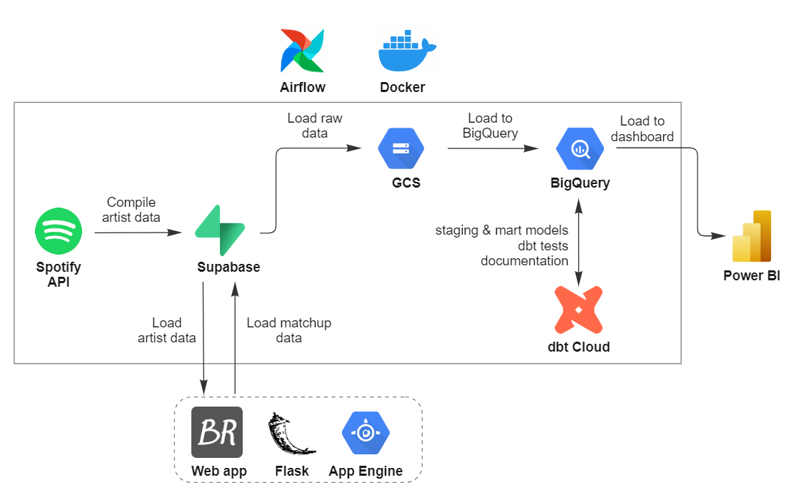

# Architecture history

## The Great Modernization of 2026

In July 2026, Spotify gated its Web API `client_credentials` flow behind an
**active Premium subscription on the app owner** — every `/search`, `/me`, and
`/playlists` call began returning:

> `403 — Active premium subscription required for the owner of the app.`

That killed the original ingestion outright. Rather than pay Spotify rent
forever, the entire stack was rebuilt on free, unofficial-but-working
foundations — in a single session with
[Claude Code](https://claude.com/claude-code). 🤖

### Before → after

| Concern | 2022 | 2026 |
|---|---|---|
| Spotify access | Web API (`client_credentials`) | `spotapi` (internal web endpoints) |
| Landing DB | Supabase Postgres | — |
| Data lake | GCS | — |
| Warehouse | BigQuery | **MotherDuck** (cloud DuckDB) |
| Transform | dbt Cloud (BigQuery) | `dbt-duckdb` → MotherDuck |
| Orchestration | Airflow + Docker | **GitHub Actions** (cron) |
| Dependencies | `requirements.txt` | `uv` (locked) |
| Dashboard | Power BI | Evidence.dev *(planned)* |
| Frontend | Flask + Bootstrap + App Engine | Next.js + Tailwind + Vercel *(planned)* |

**Retired:** Airflow, Docker-for-Airflow, GCS, BigQuery, dbt Cloud, Supabase,
Power BI, App Engine. Seven-plus moving parts collapsed to two —
**MotherDuck + GitHub Actions.**

**Data changes:**
- `popularity` (0–100, no longer exposed) → `monthly_listeners`
- per-artist `genres` (gone) → seed-based `flag_core_genre`
- added `world_rank` (artists) and `playcount` (tracks)
- `related-artists` (deprecated in the REST API) recovered via `spotapi`

**Preserved:** ~948 historical matchup votes (2022–2026) were backfilled from
Supabase into MotherDuck before Supabase was retired.

**Also picked up along the way:** the ingestion went from ~2 REST calls per
artist (sequential) to a single spotapi fetch per artist, parallelized —
~360s → ~20s for the full seed.

## The original architecture (2022) — archived for nostalgia

1. Compile artist & track data from Spotify's Web API (`Python` + `Pandas`).
2. Load to a Supabase Postgres DB with `SQLAlchemy`.
3. Serve artist/track data to the Flask web app; the user makes their picks.
4. Matchup results written back to Supabase.
5. Raw artist, track & matchup data loaded to GCS.
6. GCS → BigQuery.
7. Staging & mart models built, tested and documented with dbt.
8. BigQuery → Power BI dashboard.

Airflow (run locally via Docker) orchestrated steps 1–2 and 5–7.

Rest in peace. 🪦
